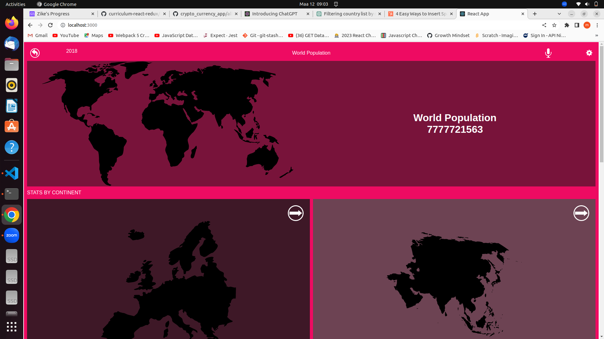
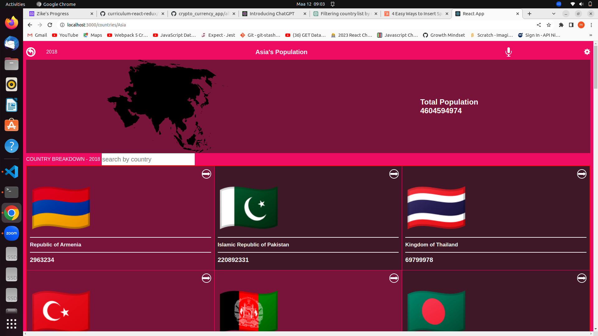
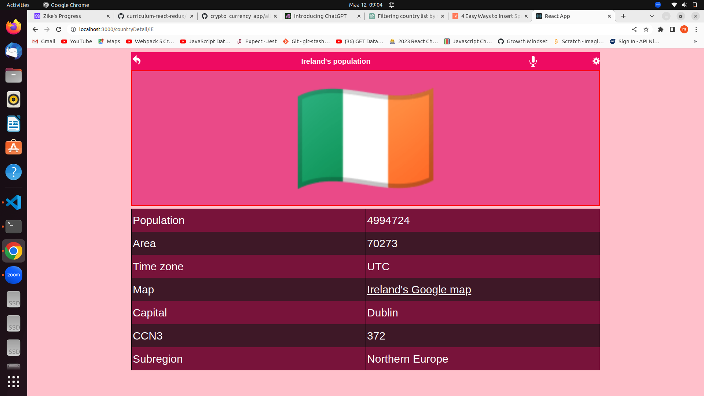

> # Space-Travelers-Hub

| Project Veiw Screenshots|
|---------------------------------------|
|

|

|

|

#  Table of Contents

- [ About the Project](#about-project)
  - [ Built With](#built-with)
    - [Tech Stack](#tech-stack)
    - [Key Features](#key-features)
  - [ Live Demo](#live-demo)
- [ Getting Started](#getting-started)
  - [Setup](#setup)
  - [Prerequisites](#prerequisites)
  - [Install](#install)
  - [Usage](#usage)
  - [Run tests](#run-tests)
  - [Deployment](#triangular_flag_on_post-deployment)
- [ Authors](#authors)
- [ Future Features](#future-features)
- [ Contributing](#contributing)
- [ Show your support](#support)
- [ Acknowledgements](#acknowledgements)
- [ FAQ (OPTIONAL)](#faq)
- [ License](#license)

<!-- PROJECT DESCRIPTION -->

#  [Metrics webapp - World population] 

> **[Metrics webapp - World population]** is a web application that shows population metrics of countries of the world fetched from the API: https://restcountries.com

##  Built With 

### Tech Stack 
- 
Client

    <ul>
      <li><a href="https://reactjs.org/">React, redux and API</a></li>
    </ul>

### Key Features 

- **[Unit testing]**
**[Fetching data from the API]**
**[Searching of counties by filter]**
**[Prop drilling using useParams]**

(<a href="#readme-top">back to top</a>)

<!-- LIVE DEMO -->

##  Live Demo 

> [Live Demo Link]()

(<a href="#readme-top">back to top</a>)

<!-- GETTING STARTED -->

##  Getting Started 

To get a local copy up and running, follow these steps:

### Prerequisites

In order to run this project you need:
  - A browser of you choice.
  - A text editor of your choice.
  - An installed node.js on your local system

### Setup

Clone this repository to your desired folder:

- Use the following Commands:

      git clone https://github.com/FrankMugagga/World-Population
      cd World-Population  

### Install

Install this project with:

  - npm install
  - npm run build

### Usage

- npm run start

### Run tests
- Run the following script and style test:

      npm start
      npm test
      npx eslint .
      npx stylelint "**/*.{css,scss}"
      
### Deployment

You can deploy this project using:
- gitHub pages/.
- npm run build.
- npm start

(<a href="#readme-top">back to top</a>)

##  Authors 

 **Frank Mugagga**

- GitHub: [@githubhandle](https://www.github.com/FrankMugagga)
- Twitter: [@twitterhandle](https://www.twitter.com/@mugagga_frank)
- LinkedIn: [LinkedIn](https://www.linkedin.com/in/frank-mugagga-17658225a)

 

(<a href="#readme-top">back to top</a>)

##  Future Features 

- **[Search by continent]**

(<a href="#readme-top">back to top</a>)

##  Contributing 

Contributions, issues, and feature requests are welcome!

Feel free to check the [issues page](https://github.com/FrankMugagga/World-Population/issues).

(<a href="#readme-top">back to top</a>)

##  Show your support 
 
  If you like this project, give it a star.

(<a href="#readme-top">back to top</a>)

##  Acknowledgments 

  We would like to acknowledge Original design idea by Nelson Sakwa on Behance.

(<a href="#readme-top">back to top</a>)

##  FAQ (OPTIONAL) 

- **How to make it mobile friendly?**

  - Put a viewport tag in the header

- **How to design the site?**

  - Draw a mockup before start to code

(<a href="#readme-top">back to top</a>)

##  License 

This project is [MIT](https://github.com/FrankMugagga/World-Population/blob/dev/LICENSE) licensed.

(<a href="#readme-top">back to top</a>)
